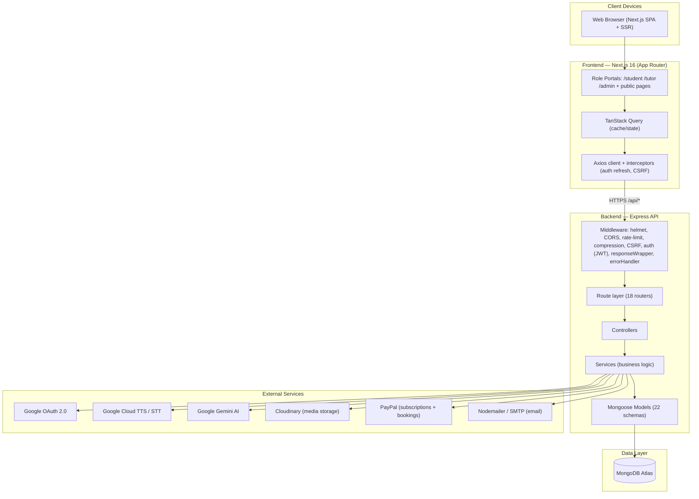
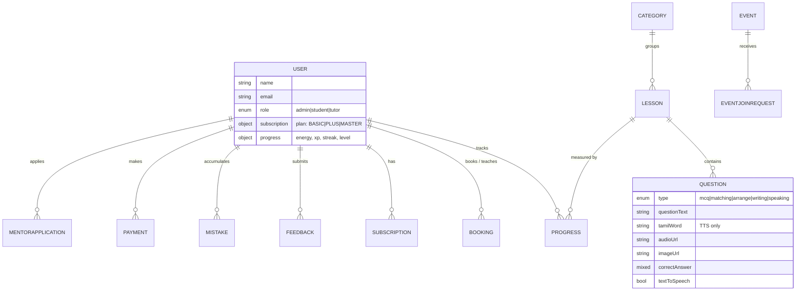
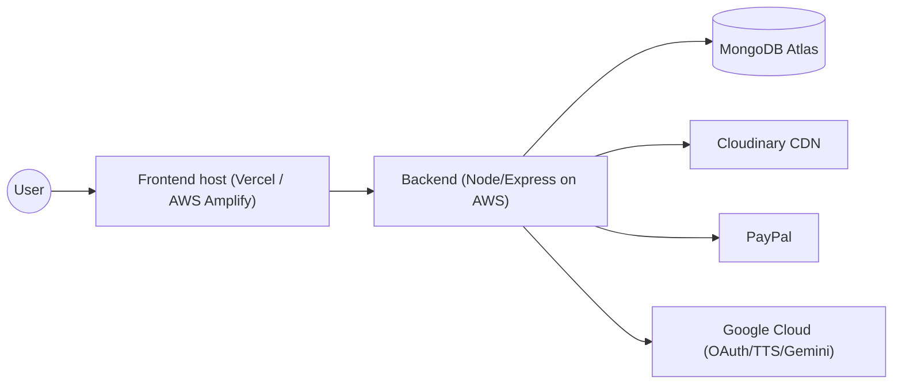

# Mozhi Aruvi — High-Level Architecture

**Platform:** Mozhi Aruvi (மொழி அருவி) — Tamil language learning platform
**Document type:** High-Level Architecture (HLA)
**Version:** 1.0
**Last updated:** May 30, 2026

---

## 1. Overview

Mozhi Aruvi is a full-stack, multi-role Tamil learning platform built as a **monorepo** with two
independently deployable applications:

| App | Technology | Responsibility |
|-----|-----------|----------------|
| `Frontend/` | Next.js 16 (App Router), React 19, TypeScript, Tailwind CSS v4 | User interface, client routing, server-rendered pages, API consumption |
| `Backend/` | Node.js, Express 4, MongoDB (Mongoose 8) | REST API, business logic, auth, payments, AI/TTS integrations |

The system serves **four primary actors** — Students, Tutors/Mentors, Admins, and Organizations —
each with a dedicated portal and role-based access control.

---

## 2. System Context Diagram



---

## 3. Architecture Style

- **Layered / N-tier backend:** `routes → controllers → services → models`. Routes validate input
  (Zod), controllers orchestrate request/response, services hold business logic, models define the
  persistence schema.
- **Client–server separation:** The frontend is fully decoupled and talks to the backend over a
  versionless REST API (`/api/*`). It can be deployed independently (Vercel / AWS Amplify) from the
  API (AWS / Node host).
- **Stateless API with cookie-based sessions:** Authentication uses JWT access tokens plus an
  HttpOnly refresh cookie; the API itself holds no in-memory session state, enabling horizontal scaling.

---

## 4. Backend Architecture

### 4.1 Request lifecycle

```
Client → Rate limiter → Compression → DB-readiness guard → Helmet/security headers
       → CORS → JSON/cookie parser → Google OAuth init → responseWrapper
       → [/api/auth bypasses CSRF] → CSRF protection → Route → Controller
       → Service → Model → MongoDB → responseWrapper → errorHandler → Client
```

### 4.2 Cross-cutting middleware (`app.js`)

| Concern | Implementation |
|---------|----------------|
| Security headers | `helmet`, no-store cache headers |
| CORS | Allow-list + `*.vercel.app` / `*.amplifyapp.com` / `*.amazonaws.com`, `credentials: true` |
| Rate limiting | `express-rate-limit` — 1000 req / 15 min per IP on `/api/` |
| Compression | `compression()` (Gzip) for smaller, faster payloads |
| CSRF | Custom `csrfProtection` (auth routes excluded for OAuth stability) |
| DB guard | Returns `503` if Mongo connection is not ready |
| Auth | JWT verification (`middleware/auth.js`), role guards (`authorizeRoles`) |
| Errors | Centralized `errorHandler` + standardized `responseWrapper` |

### 4.3 Domain modules (route → purpose)

| Router | Domain |
|--------|--------|
| `authRoutes` | Signup/login, Google OAuth, email verification, refresh, password reset |
| `userRoutes` | Profile, onboarding, gamification state |
| `lessonRoutes` | Lessons + questions CRUD, question fetch, answer submission & server-side checking |
| `categoryRoutes` | Lesson categories / curriculum ordering |
| `eventRoutes` | Live events + join requests |
| `tutorRoutes` (`/tutors`,`/mentors`,`/teachers`) | Tutor profiles, applications, financials |
| `bookingRoutes` | Tutor session bookings, tutor↔student mappings (admin) |
| `paymentRoutes` | PayPal subscriptions & one-time payments, webhooks |
| `subscriptionAdminRoutes` | Admin subscription management & stats |
| `resourceRoutes` / `resourceSectionRoutes` | Learning resources library |
| `blogRoutes` | Blog authoring & publishing |
| `feedbackRoutes` | User feedback collection |
| `organizationRoutes` | B2B / organization accounts |
| `aiRoutes` | Gemini-powered AI chat / assistance |
| `uploadRoutes` | Image & audio uploads (multer → Cloudinary) |
| `adminRoutes` | Platform administration |

### 4.4 Data model (key entities)



Other models: `Resource`, `ResourceSection`, `Blog`, `Notification`, `Transaction`,
`Organization`, `PlanSettings`, `TutorRequest`, `Session`.

---

## 5. Frontend Architecture

- **App Router (`Frontend/src/app`)** with role-segmented route groups: `student/`, `tutor/`,
  `admin/`, plus public routes (`/`, `/blogs`, `/tutors`, `/events`, `/resources`, `/auth/*`).
- **Layouts per role** (`admin/layout.tsx`, `tutor/layout.tsx`, …) wrap pages in a shared
  `DashboardLayout` with a role-specific sidebar and `allowedRoles` guard.
- **Server state:** TanStack Query handles fetching, caching, and invalidation (`staleTime` tuning
  for performance).
- **HTTP client:** A central Axios instance (`lib/api.ts`) with interceptors for automatic token
  refresh on `401`, CSRF headers, and consistent error shaping.
- **Auth context:** `AuthContext` hydrates the current user and exposes it app-wide.
- **Design system:** Tailwind CSS v4 with a custom token palette (`primary`, `secondary`,
  `surface`, `success`, …); reusable UI primitives (`DataTable`, `Toast`, `AudioUpload`,
  `QuestionSpeaker`).
- **Rich text & media:** Tiptap editor for blogs; `react-easy-crop` for image cropping; browser
  `SpeechSynthesis` + backend Google TTS for Tamil pronunciation.

---

## 6. Key Cross-Cutting Flows

### 6.1 Authentication
```
Email/password or Google OAuth → JWT access token (short-lived) + HttpOnly refresh cookie
→ Axios attaches token → on 401, interceptor calls /auth/refresh → retries original request
```

### 6.2 Lesson / Question (integrity-safe)
```
Student opens lesson → GET questions (answer keys stripped server-side)
→ Student answers → POST /lessons/:id/questions/:qId/check (server grades)
→ Server returns correctness + XP/energy delta → progress persisted
```

### 6.3 Text-to-Speech
```
Admin stores tamilWord + textToSpeech flag per question
→ Student clicks speaker → Google Cloud TTS (primary) → browser SpeechSynthesis (fallback)
→ speaks ONLY the Tamil word, never the full question text
```

### 6.4 Payments (PayPal)
```
Subscription/booking → create PayPal order/subscription → redirect to PayPal approval
→ return URL → verify session → sync plan to User.subscription + Payment record
```

---

## 7. Deployment Topology



- **Environment-driven config:** No hardcoded URLs; `NEXT_PUBLIC_API_URL` / `BACKEND_URL` on the
  frontend, `.env` secrets on the backend.
- **CORS** is configured to accept the production domains plus preview deployments.
- **Health endpoint:** `GET /health` for load-balancer probes.

---

## 8. Quality Attributes

| Attribute | How it is addressed |
|-----------|---------------------|
| Security | Helmet, CSRF, rate limiting, HttpOnly cookies, server-side answer grading, role guards |
| Performance | Gzip compression, React Query caching, `optimizePackageImports`, parallelized data fetches |
| Scalability | Stateless API, MongoDB Atlas, externalized media (Cloudinary) |
| Maintainability | Layered backend, typed frontend, reusable UI components, centralized plan-type utilities |
| Observability | Health check, dev-only request logging, standardized error responses |

---

## 9. Known Architectural Risks

See [`ERROR_AND_IMPROVEMENTS.md`](./ERROR_AND_IMPROVEMENTS.md) for the full register. The principal
items are: residual Stripe field names in the `User` schema, lack of automated tests, no centralized
logging/monitoring, and dual gamification fields (`power` vs `progress.energy`) that should be unified.
