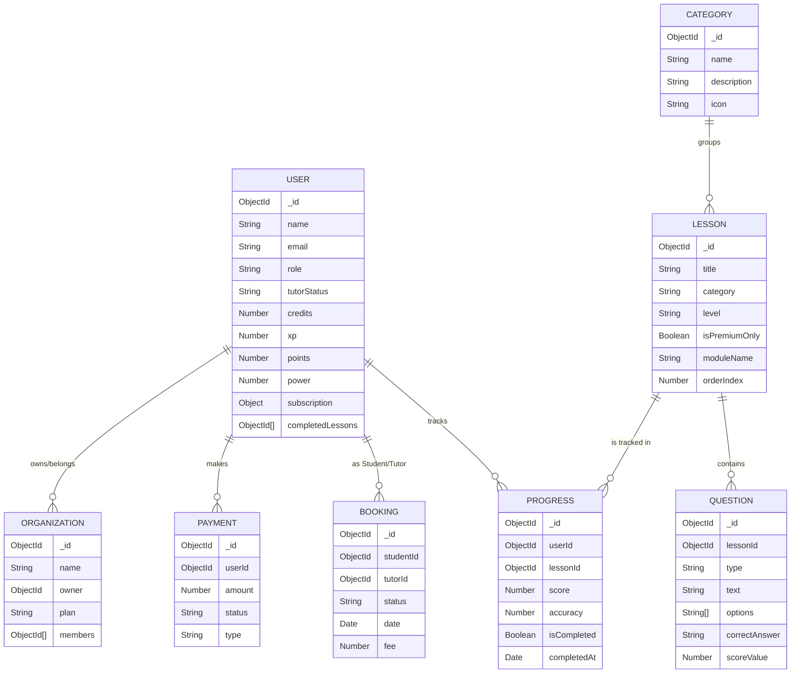

# Database Schema Report - Mozhi Aruvi

Mozhi Aruvi uses a MongoDB database managed with Mongoose. Below is the Entity-Relationship (ER) diagram and detailed model descriptions.

## ER Diagram

## Model Descriptions

- **User**: Stores profile, authentication details, and gamification metadata (XP, power, badges). It also manages subscription state and role-based permissions.
- **Lesson**: The core learning entity, representing a module or specific lesson. It belongs to a level (Basic, Beginner, etc.) and category.
- **Question**: Granular questions linked to lessons. Supports multiple types: Quiz, Speaking, Writing, Matching, etc.
- **Progress**: Tracks a specific user's performance on a specific lesson, including score and completion timestamp.
- **Booking**: Manages 1-on-1 language sessions between students and tutors.
- **Payment**: Records financial transactions related to subscriptions and tutor bookings.
- **Organization**: Allows businesses or educational groups to manage multiple student seats under a unified plan.
