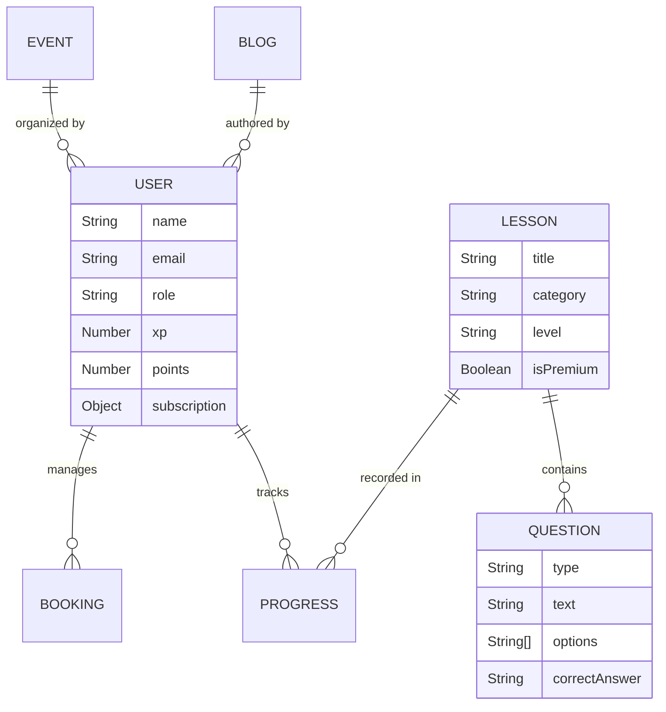

# Technical Report: Mozhi Aruvi - Premium Language Learning Platform

**Student Name:** Ajiththika Sivathas  
**Student ID:** UkiStu01  
**Project Name:** MozhiAruvi  
**Panel No.:** 01  

---

## 1. Abstract / Executive Summary
**Mozhi Aruvi** is a state-of-the-art e-learning and language platform designed to bridge the gap between language learners and expert tutors through a gamified, structured, and AI-enhanced ecosystem. The platform provides a centralized hub for Students, Tutors, and Administrators to interact seamlessly. Built with a robust full-stack architecture using **Next.js 16**, **Node.js**, **Express**, and **MongoDB**, Mozhi Aruvi ensures high performance, scalability, and security. Key outcomes include an interactive lesson engine with multimedia support, a dynamic blog system for community engagement, automated event management, and a premium subscription model integrated with Stripe. The platform leverages Cloudinary for media storage and AI for personalized learning assistance.

---

## 2. Introduction

### 2.1. Problem Statement
Traditional language learning methods often suffer from fragmented digital experiences where students must jump between different tools for lessons, tutor booking, and community interaction. Existing platforms frequently lack structured progression paths and integrated gamification that keeps learners motivated. Furthermore, there is a distinct lack of comprehensive tools for tutors to manage their schedules and for admins to oversee content quality in a single, unified environment.

### 2.2. Goals and Objectives
- **Centralized Ecosystem**: Create a single platform that handles lessons, tutoring, blogs, and events.
- **Enhanced Engagement**: Implement a gamified progression system (XP, Streaks, Power) to increase student retention.
- **Professional Tutoring**: Provide expert tutors with tools to manage bookings, profiles, and student interactions.
- **Content Management**: Enable administrators to dynamically create and manage multimedia-rich lessons and questions.
- **Secure Architecture**: Implementation of role-based access control (RBAC) and secure payment gateways.

### 2.3. Scope and Limitations
- **Scope**: Includes user authentication (JWT/OAuth), role-specific dashboards, a multi-type lesson engine (MCQ, Speaking, Writing), a blog system with TipTap editor integration, tutor booking with Stripe, and event RSVP management.
- **Limitations**: Requires stable internet connectivity for real-time AI and media rendering. Live video streaming for tutor sessions is currently handled via external links (e.g., Zoom/Google Meet), with native integration planned for future phases.

---

## 3. Requirements

### 3.1. Software Requirements
| Category | Technology |
| :--- | :--- |
| **Frontend** | Next.js 16 (App Router), React 19, TypeScript |
| **Backend** | Node.js, Express.js (RESTful API) |
| **Database** | MongoDB (Mongoose ODM) |
| **Styling** | Tailwind CSS v4, Lucide Icons |
| **State Management** | TanStack Query (React Query) |
| **Media/Storage** | Cloudinary API |
| **Payments** | Stripe Integration |
| **Authentication** | JWT (JSON Web Tokens), bcryptjs, Google OAuth |

### 3.2. Hardware Requirements
- **Development**: Minimum 8GB RAM, i5 Processor, high-speed internet.
- **Client Side**: Any modern device (Desktop, Tablet, Mobile) with an evergreen web browser (Chrome, Firefox, Safari).

---

## 4. Deployment
- **Frontend**: Vercel (Optimized for Next.js)
- **Backend**: Vercel / Railway / Render
- **Database**: MongoDB Atlas (Cloud Managed)

---

## 5. Detailed System Description

### 5.1. User Flows
- **Student Flow**: Register/Login -> Onboarding -> Dashboard (XP/Streaks) -> Browse Lessons -> Interactive Learning -> Earn Rewards -> Book Tutor / Attend Events.
- **Tutor Flow**: Register as Tutor -> Admin Approval -> Set Profile & Bio -> Define Availability & Rates -> Manage Student Bookings -> View Dashboard Analytics.
- **Admin Flow**: Secure Login -> Admin Center -> User Audit -> Approve Tutors -> Content Creation (Lessons/Questions/Blogs) -> Manage Organizations & Subscriptions.

### 5.2. Architecture & Design

#### Use Case Diagram
```mermaid
useCaseDiagram
    actor Student
    actor Tutor
    actor Admin

    package "Core Platform" {
        usecase "Gamified Lessons" as UC1
        usecase "Tutor Booking" as UC2
        usecase "Blog Reading/Writing" as UC3
        usecase "Event Participation" as UC4
        usecase "AI Learning Assistant" as UC5
        usecase "Subscription Mgmt" as UC6
    }

    Student --> UC1
    Student --> UC2
    Student --> UC3
    Student --> UC4
    Student --> UC5
    Student --> UC6

    Tutor --> UC2
    Tutor --> UC3
    
    Admin --> UC1
    Admin --> UC3
    Admin --> UC4
    Admin --> UC6
```

#### Database Schema (ER Diagram)


### 5.3. Full Feature Set
1. **Interactive Lesson Engine**: Supports various question types including Multiple Choice (MCQ), Speaking (Speech-to-Text), Writing exercises, and Matching pairs.
2. **Gamification System**: 
   - **XP & Levels**: Gain experience to unlock new badges.
   - **Power (Energy)**: Daily limits to encourage consistent learning.
   - **Streaks**: Tracks consecutive learning days to build habits.
3. **Dynamic Blog Hub**: A full-featured blog with a rich-text editor (TipTap), category filtering, and featured images for community knowledge sharing.
4. **Tutor Ecosystem**: A professional directory where students can view tutor ratings, specializations, and book one-on-one sessions via Stripe.
5. **Event Management**: Built-in system for webinars, workshops, and meetups with banner uploads and participant tracking.
6. **MozhiAruvi AI**: An integrated AI chat assistant that provides real-time explanations, translations, and learning tips.
7. **Organization Support**: Allows businesses to purchase bulk seats and manage student progress under a corporate umbrella.

---

## 6. User Interface Design
Mozhi Aruvi utilizes a **premium, vibrant indigo-based design system**. Key UI elements include:
- **Responsive Layouts**: Seamless transition from desktop wide-view to mobile-first navigation drawers.
- **Glassmorphism & Micro-animations**: Subtle hover effects and card transitions that make the platform feel "alive."
- **Accessibility-First Palette**: High-contrast typography optimized for both English and Tamil scripts.

---

## 7. Future Works
- **Real-time Collaboration**: Integrating WebSockets (Socket.io) for live chat between students and tutors.
- **Mobile Native App**: Developing React Native versions for iOS and Android.
- **Advanced Gamification**: Adding group challenges, leaderboards, and NFT-based digital certificates for course completion.
- **VR/AR Learning**: Immersive language environments for vocabulary practice.

---

**Signature:** __________________________  
**Date:** April 07, 2026
